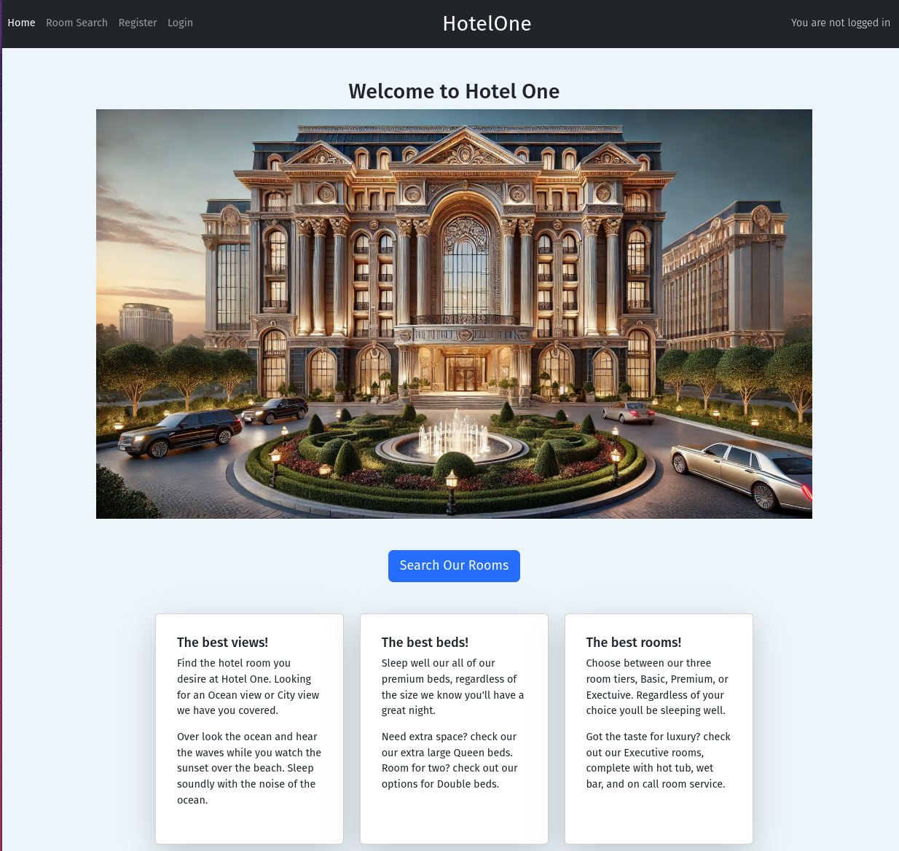
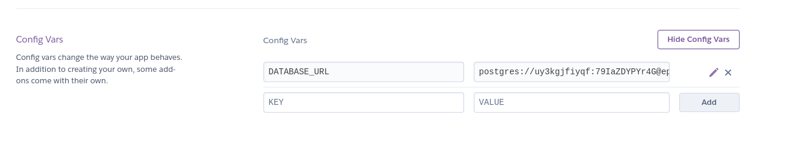
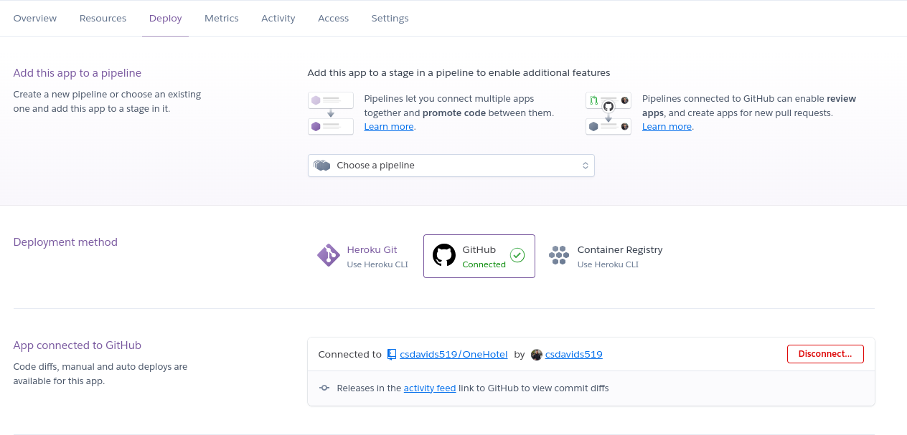

# *One Hotel*

---
*Hotel One* is a site based on a ficticous hotel, where users can create an account, search and book a hotel room, and manage their existing booking information.
This site is created with Django and runs PostgreSQL to manage a database of hotel room data and user booking data.

The live site can be found here: [Hotel One](https://onehotel-764151fc8ccf.herokuapp.com/)

## Deployment to GitHub Pages

This project was deployed with Heroku.

Steps to deploy on Heroku:

1. Create Heroku account
2. Via settings link a Config Vars variable to the data base
  
3. In Deploy tab connect to the GitHub repo.
  
4. choose automatic or manual deployments
5. Choose a branch to deploy
6. Deploy project

## Features

- Users are greeted with a welcome page that provides a quic link to the search rooms page.
- The home page also provides links to all site pages and displays the current logged in user status.

### User Login

- New users are able to create an account username and password via the 'Register' tab.
- Users have the option to manage login or logout via links in the page header, the current logged in user status is displayed in the top right of the header.

### Room Search

- Found on the room search tab, users can filter all rooms by room features such as room type, bed type, view type.
These filters can be combined to find the exact room a user desires.

### Room Detail

- Once a desired room is found, users may click this link to read more detail about the room.
- If a user is logged in, they are able to select dates to create a reservation.
- Users have a link to directly view their existing bookings.

## User Stories

- As a traveler I want to request a hotel room booking.
- As a traveler I want the ability to view existing bookings and request edits.

- As a hotel employee I want to approve room bookings.
- As a hotel employee I want full control to edit existing bookings.

### First Time Visitor Goals

- First time visitors are met with a clear and simple way to search available hotel rooms.
Once the desired room is found it is possible to make a request a booking.

### Returning Visitor Goals

- Returning visitors have access to view existing bookngs status and request edits.

---

## Technologies Used

- [Django](https://www.djangoproject.com/) - framwork used to create Hotel One.
- [PostgreSQL](https://www.postgresql.org/) - relational database used to manage Hotel One backend.
- [Bootstrap](https://getbootstrap.com/) - used to manage the css of this project.
- [Heroku](https://www.heroku.com/home) - was used to deploy the project.
- [HTML](https://developer.mozilla.org/en-US/docs/Web/HTML) was used as the foundation of the site.
- [CSS](https://developer.mozilla.org/en-US/docs/Web/css) - was used to add the styles and layout of the site.
- [Python](https://www.python.org/) - was used to create the site functions.
- [VSCode](https://code.visualstudio.com/) was used as the code editor.
- [GitHub](https://github.com/) was used to host the code of the website.
- [SourceTree](https://www.sourcetreeapp.com/) was used to manage the version control.
- [GIMP](https://www.gimp.org/) was used to edit and resize images.
- [OpenArt](https://openart.ai/home) was used to develop the hotel images used.
- [unsplash](unsplash.com) - provided free use images of the hotel rooms.
- Google Dev Tools was used for website testing.
- Google Light House was used for website testing.
- [Markup Validation Service](https://validator.w3.org/) Was used to validate the HTML code.
- [CSS Validation Service](https://jigsaw.w3.org/css-validator/) Was used to validate the CSS code.
- [Flake8](https://flake8.pycqa.org/en/latest/#) Was used to validate the Python code.

---

## Design

- Design of Hotel One is based on the Bootstrap template for ease of usage and clear design language.

## Testing

### Tests

#### Automatic Tests

Due to the models of Hotel One, its not possible to run tests within the limitations of sqlite3, therefore Postgresql is required.
Running automatic tests requires the installation of PostgreSQL on the local pc.

To install visit [PostgreSQL](https://www.postgresql.org/download/) and check the installation instructions for your operating system.

start postgres and create a new user
"""
  sudo -u postgres psql
  postgres=# CREATE USER admin WITH PASSWORD 'admin' SUPERUSER;
"""

Create a postgresql user:
  Role name: admin
  passowrd: admin
  permissions: superuser, create DB

once this is prepared and the postgresql server is running locally, its possible to run python tests from HotelOne project.

Automatic tests of Hotel One will check the booking form fields are entered correctly and not missing data as they are required. Where possible the automatic tests will also check that pages are rendered using the correct templates.

#### Manual Tests

I have manually tested this project with the following tests:

|                  Tests                  | Passed |                                           Comments                                           |
|:---------------------------------------:|:------:|:--------------------------------------------------------------------------------------------:|
| GENERAL SOFTWARE TESTS                                                                                                                          |
|:---------------------------------------:|:------:|:--------------------------------------------------------------------------------------------:|
| HTML validation                         |    X   | Passed Markup Validation Service without any errors not related to Django Template Language  |
| CSS validation                          |    X   | Passed CSS Validation Service without errors                                                 |
| Check code runs in local terminal       |    X   | One Hotel runs in local Python terminal                                                      |
| Check code runs on Heroku               |    X   | One Hotel is deployed and running on Heroku                                                  |
| Deployed version is latest main branch  |    X   | Deployed version is up to date                                                               |
| Deployed version has DEBUG set to FALSE |    X   | Deployed version of Hotel One has debug value set FALSE                                      |
| Automatic tests pass without errors     |    X   | All automatic tests pass                                                                     |
| Automatic tests pass with out failures  |    X   | All automatic tests pass                                                                     |
| Code comments are checked               |    X   | Code has correct comments on functions, no code is commented out                             |
|:---------------------------------------:|:------:|:--------------------------------------------------------------------------------------------:|
| HOME PAGE                                                                                                                                       |
|:---------------------------------------:|:------:|:--------------------------------------------------------------------------------------------:|
| All links are working                   |    X   | All links are connected to the correct url path                                              |
| All buttons are working                 |    X   | All buttons preform the correct action                                                       |
| All text is rendered correctly          |    X   | All text is clear and visible                                                                |
| Page is responsive                      |    X   | Page responds to screen size                                                                 |
| All images are loading                  |    X   | All images are loading correctly                                                             |
|                                         |        |                                                                                              |
|                                         |        |                                                                                              |
|                                         |        |                                                                                              |
|                                         |        |                                                                                              |
|                                         |        |                                                                                              |
|:---------------------------------------:|:------:|:--------------------------------------------------------------------------------------------:|
| ROOM SEARCH PAGE                                                                                                                                |
|:---------------------------------------:|:------:|:--------------------------------------------------------------------------------------------:|
| All links are working                   |   X    | All links are connected to the correct url path                                              |
| All buttons are working                 |   X    | All buttons preform the correct action                                                       |
| All text is rendered correctly          |   X    | All text is clear and visible                                                                |
| Page is responsive                      |   X    | Page responds to screen size                                                                 |
| All images are loading                  |   X    | All images are loading correctly                                                             |
|                                         |        |                                                                                              |
|                                         |        |                                                                                              |
|                                         |        |                                                                                              |
|                                         |        |                                                                                              |
|                                         |        |                                                                                              |
|:---------------------------------------:|:------:|:--------------------------------------------------------------------------------------------:|
| LOGIN, LOGOUT, REGISTER PAGES                                                                                                                   |
|:---------------------------------------:|:------:|:--------------------------------------------------------------------------------------------:|
| All links are working                   |   X    | All links are connected to the correct url path                                              |
| All buttons are working                 |   X    | All buttons preform the correct action                                                       |
| All text is rendered correctly          |   X    | All text is clear and visible                                                                |
| Page is responsive                      |   X    | Page responds to screen size                                                                 |
| All input fields are working            |   X    | All inputs work correctly                                                                    |
| log out functions correctly             |   X    | Users can log out with message response                                                      |
| log in functions correctly              |   X    | User can log in with message response and status at top right header                         |
| Register new user is possible           |   X    | New users can be created on the Register page                                                |
|                                         |        |                                                                                              |
|                                         |        |                                                                                              |
|:---------------------------------------:|:------:|:--------------------------------------------------------------------------------------------:|
| ROOM BOOKING PAGE                                                                                                                               |
|:---------------------------------------:|:------:|:--------------------------------------------------------------------------------------------:|
| All links are working                   |   X    | All links are connected to the correct url path                                              |
| All buttons are working                 |   X    | All buttons preform the correct action                                                       |
| All text is rendered correctly          |   X    | All text is clear and visible                                                                |
| Page is responsive                      |   X    | Page responds to screen size                                                                 |
| All input fields are working            |   X    | All inputs work correctly, and display errors on blank or wrong format                       |
| Booking fuction creates new booking code|   X    | New bookings are created and user is noified of booking code                                 |
| Room card displays correctly            |   X    | All text on room card is displayed correctly                                                 |

### Code Validation Tests

- Hotel One passes HTML and CSS validation without any errors that are unrelated to Django specfic projects.
- HTML pages are checked with [Markup Validation Service](https://validator.w3.org/)
- CSS code was checked with [CSS Validation Service](https://jigsaw.w3.org/css-validator/)
- Python code has been check with a linter extension [Flake8](https://flake8.pycqa.org/en/latest/#)

### Resolved Bugs / Known Issues

<!-- - While adding multiple jump objects, the issue arose that no objects would get displayed. This is because at game load the jump objects array is empty and the first check is to see what object is loaded.
The solution was to create a "first jump object", on game start a "small rock" jump object is loaded to the first line of the jump array. Once the first object is loaded the random objects can be created to the jump object array.

- The jump object array would not get cleared after objects passed the game board. This was due to the first line in the array having a different format and no screen position to measure. The solution was to remove the first array line by checking the second array line. when the second object passed a screen position limit the first object is removed from the array. -->

### Open Bugs / Issues

- No open software bugs or issues are found.

### Future improvements

- Currently users must wait for admin booking approval, this could become an automated feature based on room availability.
- Automatic emails could be sent to users regarding booking status or other informaiton.
- User experience could be improved regarding managing existing bookings.

---

## Credits

### Media

- [OpenArt](https://openart.ai/home) was used to develop the main 'grand hotel' image on the welcome page.
- [unsplash](unsplash.com) - provided free use images of the hotel rooms.

### Acknowledgments

- [Iuliia Konovalova](https://github.com/IuliiaKonovalova) Who has been a knowledgeable and encouraging mentor on this project.
<!-- - [Kevin Powell](https://www.youtube.com/@KevinPowell) Who provided lessons on using CSS modals.
- [ImKennyYip](https://github.com/ImKennyYip/flappy-bird?tab=readme-ov-file) This project has been based on the lessons learned from ImKennyYip's YouTube tutorial on how to make Flappy Bird.
- [GitHub](https://pages.github.com/) Pages for free hosting of the live site.
- [w3school](https://www.w3schools.com) Was used as a reference for all html, css, and javascript questions.
- [Text compare](https://www.textcompare.org/) used to compare Moon Jumper to the reference Flappy Bird project. -->

### Code Refrences

- [stackoverflow](https://stackoverflow.com/questions/2257441/random-string-generation-with-upper-case-letters-and-digits) - this code was refreenced to create the booking code function "create_booking_code".
- [Matt Freire](https://youtu.be/vU0VeFN-abU?si=Hjk-YYMc2y1SorgN) - Matt Freire Youtube video assisted with how to create the rooms filter functions found in "FilterList"

## Additional Resources

- [Django for Beginners 5th Edition](https://www.amazon.de/Django-Beginners-5th-Modern-Applications/dp/173546726X) - A resorce for general Django topics.
- [Django 5 by Example](https://www.packtpub.com/en-us/product/django-5-by-example-9781805122340) - Additional examples on how to create Django apps.
