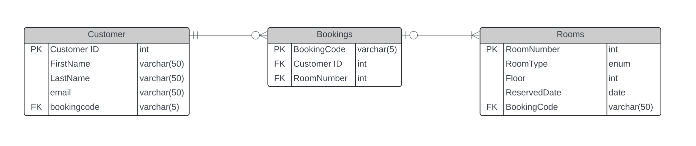
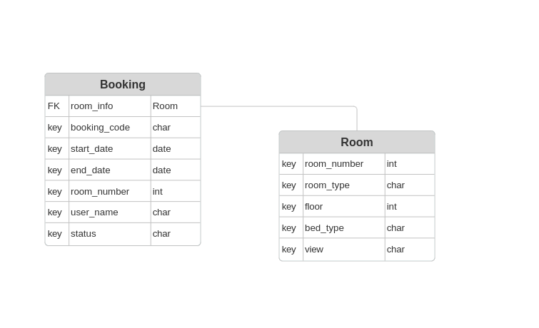

# *One Hotel*

---
*Hotel One* is a site based on a fictitious hotel, where users can create an account, search and book a hotel room, and manage their existing booking information.
This site is created with Django and runs PostgreSQL to manage a database of hotel room data and user booking data.

The live site can be found here: [Hotel One](https://onehotel-764151fc8ccf.herokuapp.com/)

The github repository can be found here:[GitHub](https://github.com/csdavids519/OneHotel)

The project agile task list can be found here: [Github Projects](https://github.com/users/csdavids519/projects/2)


## Deployment to GitHub Pages

This project was deployed with Heroku.

Steps to deploy on Heroku:

1. Create Heroku account
2. Via settings link a Config Vars variable to the data base
  
3. In Deploy tab connect to the GitHub repo.
  
4. choose automatic or manual deployments
5. Choose a branch to deploy
6. Deploy project

## Features

- Users are greeted with a welcome page that provides a quick link to the search rooms page.
- The home page also provides links to all site pages and displays the current logged in user status.

### User Login

- New users are able to create an account username and password via the 'Register' tab.
- Users have the option to manage login or logout via links in the page header, the current logged in user status is displayed in the top right of the header.

### Room Search

- Found on the room search tab, users can filter all rooms by room features such as room type, bed type, view type.
These filters can be combined to find the exact room a user desires.

### Room Detail

- Once a desired room is found, users may click this link to read more detail about the room.
- If a user is logged in, they are able to select dates to create a reservation.
- Users have a link to directly view their existing bookings.

## User Stories

- As a traveler I want to request a hotel room booking.
- As a traveler I want the ability to view existing bookings and request edits.

- As a hotel employee I want to approve room bookings.
- As a hotel employee I want full control to edit existing bookings.

### First Time Visitor Goals

- First time visitors are met with a clear and simple way to search available hotel rooms.
Once the desired room is found it is possible to make a request a booking.

### Returning Visitor Goals

- Returning visitors have access to view existing bookings status and request edits.

---

## Technologies Used

- [Django](https://www.djangoproject.com/) - framework used to create Hotel One.
- [PostgreSQL](https://www.postgresql.org/) - relational database used to manage Hotel One backend.
- [Bootstrap](https://getbootstrap.com/) - used to manage the css of this project.
- [Heroku](https://www.heroku.com/home) - was used to deploy the project.
- [HTML](https://developer.mozilla.org/en-US/docs/Web/HTML) was used as the foundation of the site.
- [CSS](https://developer.mozilla.org/en-US/docs/Web/css) - was used to add the styles and layout of the site.
- [Python](https://www.python.org/) - was used to create the site functions.
- [VSCode](https://code.visualstudio.com/) was used as the code editor.
- [GitHub](https://github.com/) was used to host the code of the website.
- [SourceTree](https://www.sourcetreeapp.com/) was used to manage the version control.
- [GIMP](https://www.gimp.org/) was used to edit and resize images.
- [OpenArt](https://openart.ai/home) was used to develop the hotel images used.
- [unsplash](unsplash.com) - provided free use images of the hotel rooms.
- Google Dev Tools was used for website testing.
- Google Light House was used for website testing.
- [Markup Validation Service](https://validator.w3.org/) Was used to validate the HTML code.
- [CSS Validation Service](https://jigsaw.w3.org/css-validator/) Was used to validate the CSS code.
- [Flake8](https://flake8.pycqa.org/en/latest/#) Was used to validate the Python code.
- [Tables Generator](https://www.tablesgenerator.com/markdown_tables) Was used to quickly create the manual tests table in markdown

---

## Design

- Design of Hotel One is based on the Bootstrap template for ease of usage and clear design language.

- The wireframe design:


- The original ER diagram:
.

- Updated current ER diagram


---

## Testing

### Tests

#### Automatic Tests

Due to the models of Hotel One, its not possible to run tests within the limitations of sqlite3, therefore Postgresql is required.
Running automatic tests requires the installation of PostgreSQL on the local pc.

To install visit [PostgreSQL](https://www.postgresql.org/download/) and check the installation instructions for your operating system.

start postgres and create a new user

  ``` bash
    sudo -u postgres psql
    postgres=# CREATE USER admin WITH PASSWORD 'admin' SUPERUSER;
  ```

Create a postgresql user:
  Role name: admin
  password: admin
  permissions: superuser, create DB

once this is prepared and the postgresql server is running locally, its possible to run python tests from HotelOne project.

Automatic tests of Hotel One will check the booking form fields are entered correctly and not missing data as they are required. Where possible the automatic tests will also check that pages are rendered using the correct templates.

#### Manual Tests

I have manually tested this project with the following tests:

| **Tests**                                    | **Passed** | **Comments**                                                                               |
|----------------------------------------------|------------|-------------------------------------------------------------------------------------------|
| **GENERAL SOFTWARE TESTS**                   |            |                                                                                           |
| HTML validation                              | X          | Passed Markup Validation Service without any errors not related to Django Template Language. |
| CSS validation                               | X          | Passed CSS Validation Service without errors.                                              |
| Check code runs in local terminal            | X          | One Hotel runs in the local Python terminal.                                              |
| Check code runs on Heroku                    | X          | One Hotel is deployed and running on Heroku.                                              |
| Deployed version is latest main branch       | X          | Deployed version is up to date.                                                           |
| Deployed version has DEBUG set to FALSE      | X          | Deployed version of Hotel One has DEBUG value set to FALSE.                               |
| Automatic tests pass without errors          | X          | All automatic tests pass.                                                                 |
| Automatic tests pass without failures        | X          | All automatic tests pass.                                                                 |
| Code comments are checked                    | X          | Code has correct comments on functions; no code is commented out unnecessarily.           |
| **HOME PAGE**                                |            |                                                                                           |
| All links are working                        | X          | All links are connected to the correct URL path.                                          |
| All buttons are working                      | X          | All buttons perform the correct action.                                                   |
| All text is rendered correctly               | X          | All text is clear and visible.                                                            |
| Page is responsive                           | X          | Page responds to screen size.                                                             |
| All images are loading                       | X          | All images are loading correctly.                                                        |
| **ROOM SEARCH PAGE**                         |            |                                                                                           |
| All links are working                        | X          | All links are connected to the correct URL path.                                          |
| All buttons are working                      | X          | All buttons perform the correct action.                                                   |
| All text is rendered correctly               | X          | All text is clear and visible.                                                            |
| Page is responsive                           | X          | Page responds to screen size.                                                             |
| All images are loading                       | X          | All images are loading correctly.                                                        |
| **LOGIN, LOGOUT, REGISTER PAGES**            |            |                                                                                           |
| All links are working                        | X          | All links are connected to the correct URL path.                                          |
| All buttons are working                      | X          | All buttons perform the correct action.                                                   |
| All text is rendered correctly               | X          | All text is clear and visible.                                                            |
| Page is responsive                           | X          | Page responds to screen size.                                                             |
| All input fields are working                 | X          | All inputs work correctly.                                                                |
| Log out functions correctly                  | X          | Users can log out with a message response.                                                |
| Log in functions correctly                   | X          | Users can log in with a message response and status at the top-right header.              |
| Register new user is possible                | X          | New users can be created on the Register page.                                            |
| **ROOM BOOKING PAGE**                        |            |                                                                                           |
| All links are working                        | X          | All links are connected to the correct URL path.                                          |
| All buttons are working                      | X          | All buttons perform the correct action.                                                   |
| All text is rendered correctly               | X          | All text is clear and visible.                                                            |
| Page is responsive                           | X          | Page responds to screen size.                                                             |
| All input fields are working                 | X          | All inputs work correctly and display errors on blank or wrong format.                    |
| Booking function creates new booking code    | X          | New bookings are created, and the user is notified of the booking code.                   |
| Room card displays correctly                 | X          | All text on the room card is displayed correctly.                                         |
| **USER BOOKINGS PAGE**                       |            |                                                                                           |
| All links are working                        | X          | All links are connected to the correct URL path.                                          |
| All buttons are working                      | X          | All buttons perform the correct action.                                                   |
| All text is rendered correctly               | X          | All text is clear and visible.                                                            |
| Page is responsive                           | X          | Page responds to screen size.                                                             |
| Existing bookings are displayed              | X          | All user bookings are displayed in a table.                                               |
| Users cannot edit approved bookings          | X          | Users are blocked from editing or deleting approved bookings; a warning message is shown. |
| Users can edit dates of "In Review" bookings | X          | Dates can be modified by users.                                                           |

### Code Validation Tests

- Hotel One passes HTML and CSS validation without any errors that are unrelated to Django specific projects.
- HTML pages are checked with [Markup Validation Service](https://validator.w3.org/)
- CSS code was checked with [CSS Validation Service](https://jigsaw.w3.org/css-validator/)
- Python code has been check with a linter extension [Flake8](https://flake8.pycqa.org/en/latest/#)

### Resolved Bugs / Known Issues / Challenges

- While attempting to run automatic tests, it was discovered sqlite3 database was not able to manage the Hotel One models.
Therefor some effort was spent to link a local postgresql database server to the local host. This allowed the tests to run as expected.
Because of this change, to run automatic Python tests, its required to install postgresql on the local pc and create a user called admin with password admin.

- The original development plan of the Hotel One models included a customer model, the idea was to use a booking code model to link a customer and a room. During development it was realized this was not necessary as Django could manage the user accounts, once a booking is created it loads user and room information into the booking model.

- Creating booking page posed challenges to get the 'room_detail' view to work as intended with adding a unique booking code to each new booking. While also linking the current room information and user information. This was accomplished in the end by directing the user to a separate page for each room "room detail", this allowed the usage of the room number as a link to the room model data. This Room data was then passed to the booking model along with the current logged in user. During the POST of the room_detail view, each post request creates a random string to be used as the booking code.

### Open Bugs / Issues

- No open software bugs or issues are found.

### Future improvements

- Currently users must wait for admin booking approval, this could become an automated feature based on room availability.
- Automatic emails could be sent to users regarding booking status or other information.
- User experience could be improved regarding managing existing bookings.
- Additional and more complicated automatic tests could be added to more quickly check site functionality.

---

## Credits

### Media

- [OpenArt](https://openart.ai/home) was used to develop the main 'grand hotel' image on the welcome page.
- [unsplash](unsplash.com) - provided free use images of the hotel rooms.

### Acknowledgments

- [Iuliia Konovalova](https://github.com/IuliiaKonovalova) Who has been a knowledgeable and encouraging mentor on this project.
- [Heroku](https://www.heroku.com/) Pages for free hosting of the live site.

### Code References

- [stackoverflow](https://stackoverflow.com/questions/2257441/random-string-generation-with-upper-case-letters-and-digits) - this code was referenced to create the booking code function "create_booking_code".
- [Matt Freire](https://youtu.be/vU0VeFN-abU?si=Hjk-YYMc2y1SorgN) - Matt Freire Youtube video assisted with how to create the rooms filter functions found in "FilterList"

## Additional Resources

- [Django for Beginners 5th Edition](https://www.amazon.de/Django-Beginners-5th-Modern-Applications/dp/173546726X) - A resource for general Django topics.
- [Django 5 by Example](https://www.packtpub.com/en-us/product/django-5-by-example-9781805122340) - Additional examples on how to create Django apps.
- [ChatGPT](https://chatgpt.com/) - for responding to endless questions as a valued searching resource. This is truly the end of the Google search bar.
- [StackOverflow](https://stackoverflow.com/) - as a resource for 'how to' when things get challenging.
